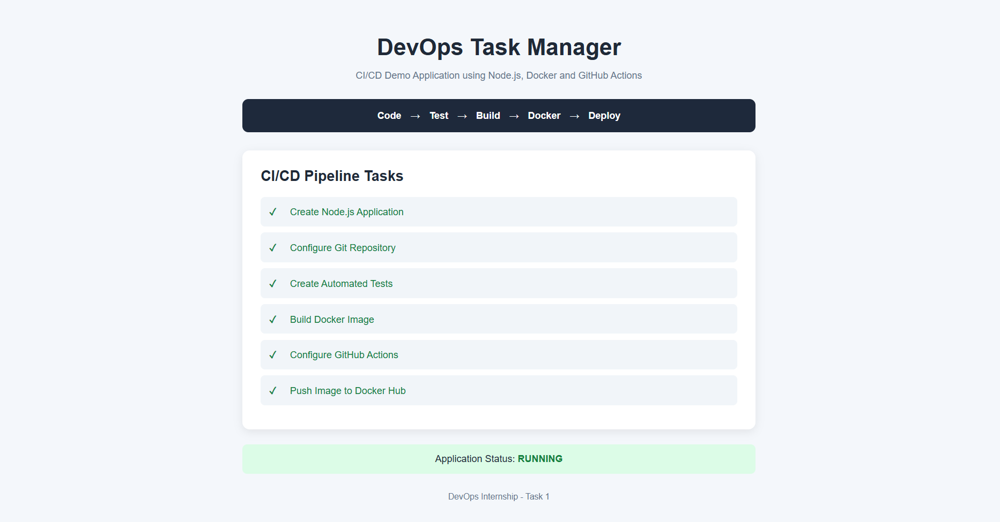
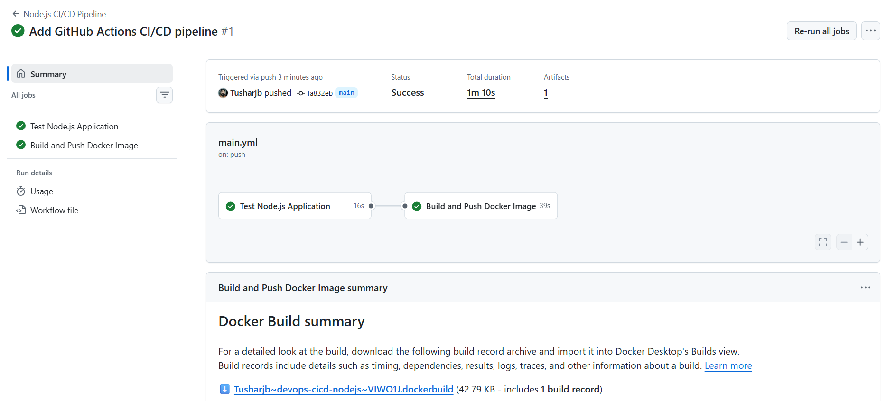
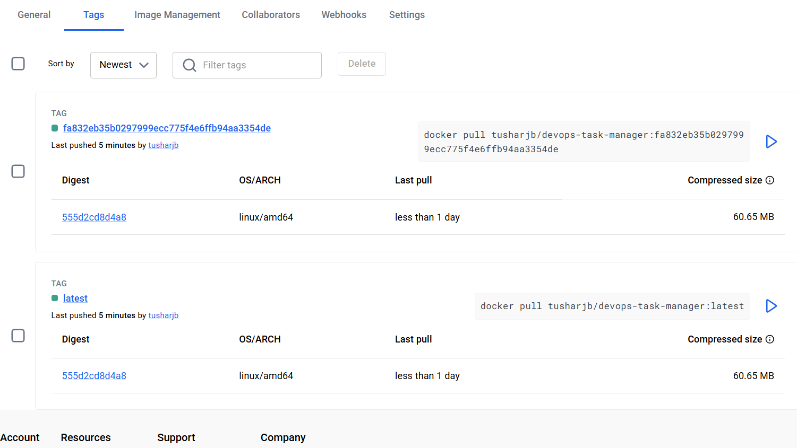

# DevOps CI/CD Pipeline - Node.js Application

This project was created as part of **DevOps Internship Task 1** to demonstrate automated application testing, Docker image building, and Docker image deployment using **GitHub Actions**.

## Objective

Set up a CI/CD pipeline to build, test, and deploy a Node.js web application.

The pipeline automatically performs:

```text
Code Push → Automated Tests → Docker Build → Docker Hub Push
```

Whenever code is pushed to the `main` branch, GitHub Actions starts the CI/CD workflow.

## Technologies Used

- Node.js
- Express.js
- Jest
- Supertest
- Docker
- Docker Hub
- Git
- GitHub
- GitHub Actions

## Application

The project contains a simple **DevOps Task Manager** web application built using Node.js and Express.

The application also provides a health-check endpoint:

```text
GET /api/health
```

Example response:

```json
{
  "status": "UP",
  "message": "DevOps CI/CD application is running"
}
```

## Project Structure

```text
devops-cicd-nodejs/
├── .github/
│   └── workflows/
│       └── main.yml
├── public/
│   ├── index.html
│   └── style.css
├── src/
│   └── app.js
├── test/
│   └── app.test.js
├── screenshots/
├── .dockerignore
├── .gitignore
├── Dockerfile
├── LICENSE
├── package.json
├── package-lock.json
└── README.md
```

## Run the Application Locally

Clone the repository:

```bash
git clone https://github.com/Tusharjb/devops-cicd-nodejs.git
cd devops-cicd-nodejs
```

Install dependencies:

```bash
npm ci
```

Start the application:

```bash
npm start
```

Open:

```text
http://localhost:3000
```

## Automated Testing

The project uses **Jest** and **Supertest** for automated testing.

Run:

```bash
npm test
```

The test suite validates:

- The web application loads successfully.
- The `/api/health` endpoint returns an `UP` status.

## Docker

Build the Docker image:

```bash
docker build -t devops-task-manager .
```

Run the container:

```bash
docker run -p 3000:3000 devops-task-manager
```

Then open:

```text
http://localhost:3000
```

## Docker Hub

The application image is published to Docker Hub as:

```text
tusharjb/devops-task-manager
```

Pull the latest image:

```bash
docker pull tusharjb/devops-task-manager:latest
```

Run it:

```bash
docker run -p 3000:3000 tusharjb/devops-task-manager:latest
```

## CI/CD Pipeline

The GitHub Actions workflow is defined in:

```text
.github/workflows/main.yml
```

The pipeline is triggered automatically on a push to the `main` branch.

### Pipeline Flow

```text
Push to main
     │
     ▼
Checkout Repository
     │
     ▼
Setup Node.js
     │
     ▼
Install Dependencies
     │
     ▼
Run Automated Tests
     │
     ▼
Build Docker Image
     │
     ▼
Login to Docker Hub
     │
     ▼
Push Docker Image
```

The Docker build-and-push job depends on the test job. Therefore, if automated testing fails, the Docker image is not pushed.

## Docker Image Tags

The CI/CD pipeline publishes two image tags:

```text
tusharjb/devops-task-manager:latest
```

and:

```text
tusharjb/devops-task-manager:<git-commit-sha>
```

The commit SHA tag makes each CI/CD-generated Docker image traceable to the Git commit that produced it.

## GitHub Actions Secrets

Docker Hub credentials are not stored in the source code.

The pipeline uses GitHub Actions repository secrets:

```text
DOCKER_USERNAME
DOCKER_TOKEN
```

These secrets are securely referenced by the GitHub Actions workflow during Docker Hub authentication.

## Screenshots

### Application Running

The application is successfully running after completing the CI/CD workflow.



### Successful GitHub Actions Pipeline

The GitHub Actions workflow successfully runs automated tests, builds the Docker image, and pushes it to Docker Hub.



### Docker Hub Images

The Docker image is automatically published to Docker Hub after a successful CI/CD pipeline execution.



## What I Learned

Through this project, I learned how to:

- Create a Node.js web application.
- Write and execute automated tests.
- Containerize an application using Docker.
- Create Docker images and run containers.
- Configure GitHub Actions workflows.
- Store credentials securely using GitHub Actions secrets.
- Implement dependencies between CI/CD jobs.
- Automatically build and push Docker images to Docker Hub.
- Tag Docker images using Git commit SHAs.
- Troubleshoot and verify a complete CI/CD workflow.

## License

This project is licensed under the MIT License.